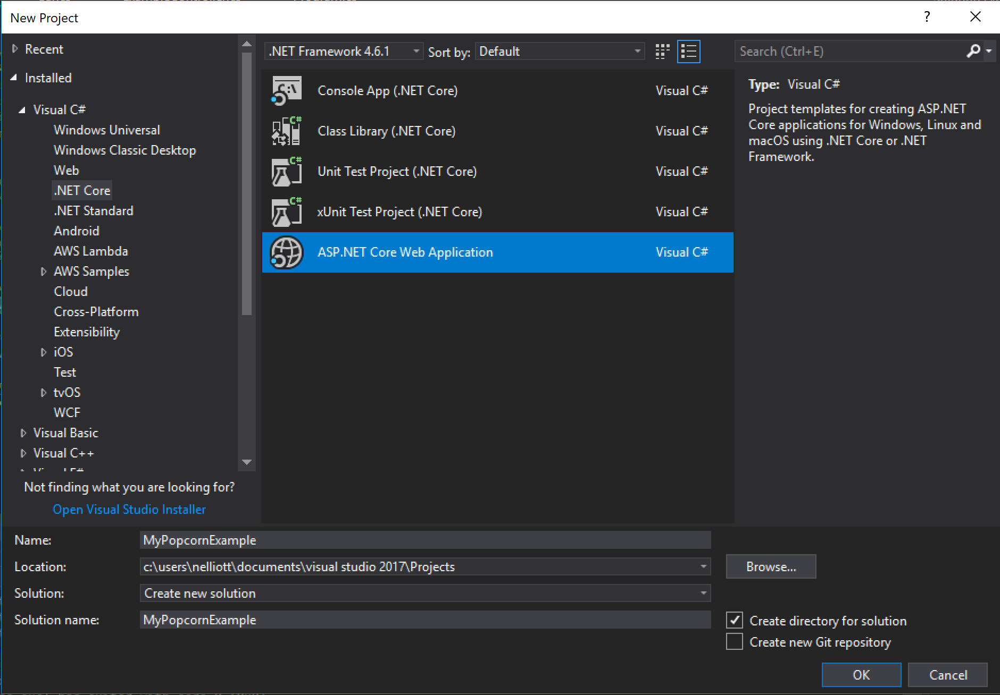
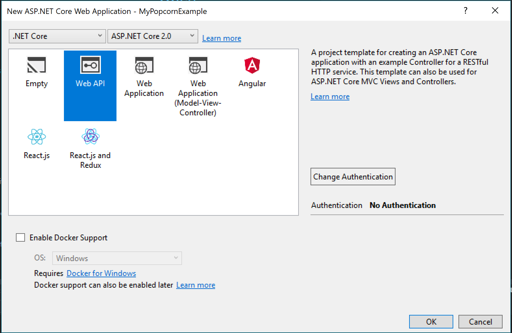
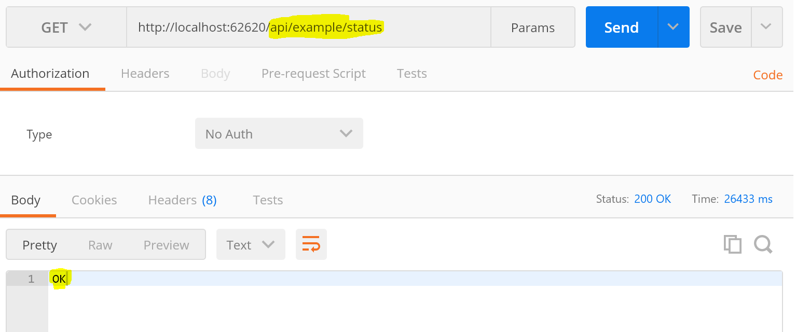
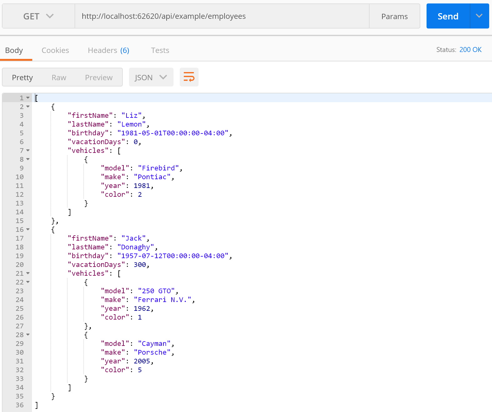

# [Popcorn](../../README.md) > [Documentation](../Documentation.md) > DotNet > Tutorial: Getting Started

Ok, so you want to jump in with both feet and get Popcorn set up and running.
This tutorial will walk through a simple Asp.Net Core application demonstrating the basic functionality.

All source code is available in the 'PopcornCoreExample' project in the dotnet solution.

To get us started off, create a brand new 'Asp.Net Core' project.


Make sure to choose 'Web Api' as your project type to get the appropriate templates in place.


You should now have a 'Program.cs' file that sets up the hosting environment,
and a 'Startup.cs' configuring the Web Api.

There's also a ValueController by default.  We don't need it, so go ahead and delete it.
Instead, lets create an 'ExampleController' with just one endpoint for now.

```csharp
using System.Collections.Generic;
using Microsoft.AspNetCore.Mvc;

namespace PopcornCoreExample.Controllers
{
    [Route("api/example/")]
    public class ExampleController : Controller
    {
        [HttpGet, Route("status")]
        public string Status()
        {
            return "OK";
        }
    }
}
```

Lets take a breather after all that intense work, and make sure our basic app is up and running.
Let me introduce you to [Postman](https://www.getpostman.com/) which we'll use to test our controller.
Fire it up, start your Web Api project, and execute a 'GET' request against your new endpoint '/api/example/status'



Great, it's responding!  Now we can start to introduce some Popcorn!

To get started, create a 'Models' subfolder in your project, and add two classes: Employee and Car.

```csharp
public class Employee
{
    public string FirstName { get; set; }
    public string LastName { get; set; }

    public DateTimeOffset Birthday { get; set; }
    public int VacationDays { get; set; }

    public List<Car> Vehicles { get; set; }
}
```

```csharp
public class Car
{
    public string Model { get; set; }
    public string Make { get; set; }
    public int Year { get; set; }
    
    public enum Colors
    {
        Black,
        Red,
        Blue,
        Gray,
        White,
        Yellow,
    }
    public Colors Color { get; set; }
}
```

These are the entities we'll be querying for via the API.

Lets add a 'ExampleContext' class that will act as a in-memory repository for our test data.
```csharp
public class ExampleContext
{
    public List<Car> Cars { get; } = new List<Car>();
    public List<Employee> Employees { get; } = new List<Employee>();
}
```

We'll need to add some test data to the project to prove that everything is working.  Time to revisit 'Startup.cs' and add a new method:
```csharp
private ExampleContext CreateExampleDatabase()
{
    var context = new ExampleContext();
    var liz = new Employee
    {
        FirstName = "Liz",
        LastName = "Lemon",
        Birthday = DateTimeOffset.Parse("1981-05-01"),
        VacationDays = 0,
        Vehicles = new List<Car>()
    };
    var firebird = new Car
    {
        Make = "Pontiac",
        Model = "Firebird",
        Year = 1981,
        Color = Car.Colors.Blue
    };
    context.Cars.Add(firebird);
    liz.Vehicles.Add(firebird);
    context.Employees.Add(liz);

    var jack = new Employee
    {
        FirstName = "Jack",
        LastName = "Donaghy",
        Birthday = DateTimeOffset.Parse("1957-07-12"),
        VacationDays = 300,
        Vehicles = new List<Car>()
    };
    var ferrari = new Car
    {
        Make = "Ferrari N.V.",
        Model = "250 GTO",
        Year = 1962,
        Color = Car.Colors.Red
    };
    context.Cars.Add(ferrari);
    jack.Vehicles.Add(ferrari);
    var porsche = new Car
    {
        Make = "Porsche",
        Model = "Cayman",
        Year = 2005,
        Color = Car.Colors.Yellow
    };
    context.Cars.Add(porsche);
    jack.Vehicles.Add(porsche);
    context.Employees.Add(jack);

    return context;
}
```

Now we need to introduce this data into the application as a dependency injection.  Modify Startup::ConfigureServices:
```csharp
// This method gets called by the runtime. Use this method to add services to the container.
public void ConfigureServices(IServiceCollection services)
{
    var database = CreateExampleDatabase();
    services.AddSingleton<ExampleContext>(database);
}
```

And make sure this is injected into ExampleController via the constructor:
```csharp
[Route("api/example/")]
public class ExampleController : Controller
{
    ExampleContext _context;
    public ExampleController(ExampleContext context)
    {
        _context = context;
    }
    
    ...
```

While we're here, lets add an endpoint that a user can query for data with.
```csharp
[HttpGet, Route("employees")]
public List<Employee> Employees()
{
    return _context.Employees;
}
```

Before we introduce Popcorn for real, lets check that this all works, and demonstrate why we even *need* Popcorn in the first place.
Our old friend Postman will help us out.  Issue a 'GET' to '/api/example/employees'


We have all our data here! Great! Our entire heirarchy has been returned to us.
But... what if we didn't actually *care* about the vehicles? That could be a ton of information that we don't even need, sucking up our data plan.
That wouldn't make us a responsible internet citizen.  So let's add Popcorn and see how it saves us time, money, and brings about world peace.

If you haven't already, now would be a great time to visit the [Quick Start Guide](DotNetQuickStart.md) and make sure you've got Popcorn linked into 
your project correctly.

To utilize Popcorn we need to do three things (in the future, only one, so come back when v2 is released!).  
Add two 'projections', which are the data types that format our outgoing data. Create a 'Projections' folder in our solution, then add:

```csharp
public class EmployeeProjection
{
	public string FirstName { get; set; }
	public string LastName { get; set; }

	public DateTimeOffset? Birthday { get; set; }
	public int? VacationDays { get; set; }

	public List<CarProjection> Vehicles { get; set; }
}
```
```csharp
public class CarProjection
{
	public string Model { get; set; }
	public string Make { get; set; }
	public int? Year { get; set; }
	public string Color { get; set; }
}
```

Okay, so you may be wondering why we even need these.  In the future we hope to skip projections where there's no advanced setup needed, but for now two things:
1. We want to make all non-nullable types nullable, so they don't need to be included if not desired.
2. We have to 'whitelist' properties.  Any property not on the destination type will not be included, even if explicitly requested.
So if you have a property called 'SuperSecretEncryptionKeyNeverShare', you can exclude it from the projection and be sure that no Api client will see it.

For advanced setup, as you'll see in later tutorials, projections give you a lot of control.

Finally, we need to activate Popcorn on our pipeline and let it know about the projections.  Back in good ole' Startup.cs:
```csharp
// This method gets called by the runtime. Use this method to add services to the container.
public void ConfigureServices(IServiceCollection services)
{
	var database = CreateExampleDatabase();
	services.AddSingleton<ExampleContext>(database);

	// Add framework services.
	services.AddMvc((mvcOptions) =>
	{
		mvcOptions.UsePopcorn((popcornConfig) => {
			popcornConfig
				.Map<Employee, EmployeeProjection>()
				.Map<Car, CarProjection>();
		});
	});
}
```

We let the mvc pipeline know we want to use Popcorn, then configure Popcorn with two mappings, Employee -> EmployeeProjection and Car -> CarProjection.
Again, in the roadmap we have features to auto-detect simple mappings like these or obviate the need for a projection at all.


Ok next is... well actually, that's it! To demonstrate, first call the same endpoint '/api/example/employees' and verify it looks the same:
```javascript
[
    {
        "FirstName": "Liz",
        "LastName": "Lemon",
        "Birthday": "1981-05-01T00:00:00-04:00",
        "VacationDays": 0,
        "Vehicles": [
            {
                "Model": "Firebird",
                "Make": "Pontiac",
                "Year": 1981,
                "Color": "Blue"
            }
        ]
    },
    {
        "FirstName": "Jack",
        "LastName": "Donaghy",
        "Birthday": "1957-07-12T00:00:00-04:00",
        "VacationDays": 300,
        "Vehicles": [
            {
                "Model": "250 GTO",
                "Make": "Ferrari N.V.",
                "Year": 1962,
                "Color": "Red"
            },
            {
                "Model": "Cayman",
                "Make": "Porsche",
                "Year": 2005,
                "Color": "Yellow"
            }
        ]
    }
]
```

A couple of things to point out: The casing has changed due to our internal popcorn settings (FirstName instead of firstName).  
Also, our Colors enumeration has gone from a numeric format (1,5) to textual (Red, Yellow).  Personally I think that's awesome, but it can all be configured to your tastes.

To start seeing the real power of Popcorn, lets make a couple of advanced calls.  Maybe we only want our Employee's names? 
Make a GET request to '/api/example/employees?include=[FirstName,LastName]':
```javascript
[
    {
        "FirstName": "Liz",
        "LastName": "Lemon"
    },
    {
        "FirstName": "Jack",
        "LastName": "Donaghy"
    }
]
```
Wow! Now we only transfer the data we really need!  

The include syntax can be referenced into sub-entities too.
Try a GET request to '/api/example/employees?include=[FirstName,LastName,Vehicles[Make]]':
```javascript
[
    {
        "FirstName": "Liz",
        "LastName": "Lemon",
        "Vehicles": [
            {
                "Make": "Pontiac"
            }
        ]
    },
    {
        "FirstName": "Jack",
        "LastName": "Donaghy",
        "Vehicles": [
            {
                "Make": "Ferrari N.V."
            },
            {
                "Make": "Porsche"
            }
        ]
    }
]
```
As you can see, you can use this syntax to make the response data as light or as deep as you need for any given situation.

