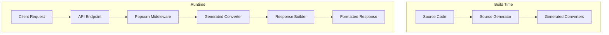
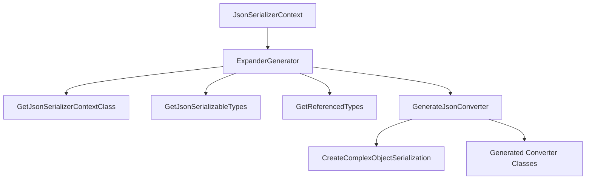

# System Patterns: Popcorn

## Architecture Overview

### Protocol Layer
- Sits on top of RESTful APIs
- Query string-based field selection
- Future support for header-based selection
- Standardized response formatting

### Component Structure


### Source Generator Architecture


## Key Design Patterns

### Field Selection Pattern

#### Query Mechanisms
1. Query String Parameter
   - Parameter name: 'include'
   - Primary supported method
   - Example: `?include=[field1,field2]`

2. HTTP Header (Planned)
   - Header name: 'POPCORN-INCLUDE'
   - Not yet implemented
   - Will provide alternative to query string

#### Field Naming Rules
- Must start with letter or underscore
- Must contain at least one non-underscore
- Minimum length: 2 characters
- Regex validation: `/[A-Za-z_][A-Za-z0-9_]*[A-Za-z0-9]+[A-Za-z0-9_]*/`

#### Valid Examples
```
[]                                          # Empty selection
[FirstName,LastName]                        # Simple fields
[MyProperty1,_ASecondProperty,_0]           # Numbers and underscores
[FirstName,Child[FirstName,LastName],_Age]  # Nested entities
[AllMyChildren[FirstName,LastName]]         # Collections
```

#### Invalid Examples
```
[1One]              # Starts with number
[Property!Name]     # Contains punctuation
[A]                 # Single character
[___]               # Only underscores
```

### Expansion Pattern
- Recursive field resolution
- Lazy loading support
- Circular reference protection
- Default field handling

### Provider Pattern
- Platform-specific implementations
- Common protocol adherence
- Extensible architecture
- Standardized interfaces

### Source Generator Pattern
- Build-time code generation
- AOT compatibility
- Attribute-based control
- Type-safe serialization

## Technical Decisions

### Query String vs Headers
1. **Current Approach**: Query String
   - Easy to test and debug
   - Visible in browser
   - Cacheable
   - URL length limitations

2. **Future Support**: Headers
   - No length limitations
   - Cleaner URLs
   - Better for POST/PUT requests

### Field Naming Convention
- Must start with letter or underscore
- Must contain at least one non-underscore
- Minimum length of two characters
- Alphanumeric and underscore only

### Default Behavior
- Entity-specific default fields
- Implicit field inclusion rules
- Empty selection handling
- Subentity default resolution

### Attribute System
- `[Always]` - Property always included in serialization
- `[Never]` - Property never included in serialization
- `[Default]` - Property included by default unless excluded

## Implementation Guidelines

### Provider Implementation
1. **Core Requirements**
   - Field parsing
   - Query execution
   - Response formatting
   - Error handling

2. **Optional Features**
   - Authorization
   - Sorting
   - Pagination
   - Filtering

### Error Handling
- Invalid field names
- Circular references
- Authorization violations
- Resource not found
- Malformed requests

### Performance Considerations
- Query optimization
- Eager loading
- Caching strategies
- Response compression

### Source Generator Improvements
1. **Critical Issues**
   - Comprehensive test coverage
   - Circular reference detection
   - Thread safety in PopcornAccessor
   - Property reference validation
   - Attribute conflict detection

2. **Performance Improvements**
   - Property reference parsing optimization
   - Generated code optimization

3. **API Improvements**
   - Error state support
   - Deserialization support
   - XML documentation
   - Diagnostic message improvements
