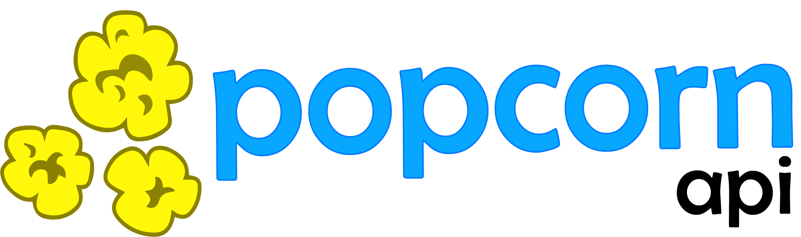

# Popcorn

## Overview

Popcorn is a communication protocol on top of a RESTful API that allows requesting clients to identify individual fields of resources to include when retrieving the resource or resource collection.

It allows for a recursive selection of fields, allowing multiple calls to be condensed into one. 

See specifications for the call-response model on [GitHub](https://github.com/SkywardApps/popcorn)

## Getting Started

This presumes you have a RESTful web-api you are building, utilizing Typescript for typing and inversify-express-utils to scaffold your API endpoints on top of express.

### Requirements

* InversifyJS & inversify-express-utils
* Typescript
* Express

## Authors

[Skyward App Company, LLC](https://skywardapps.com)

## Technologies

    

 